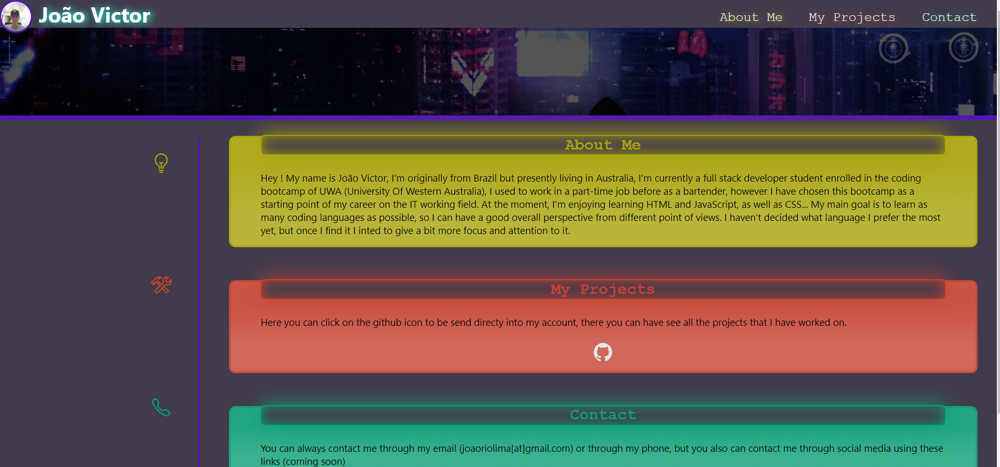

# Portfolio website creation 

# 📖 Task requirements:

* This task was a portfolio website creation, made from scratch using only HTML and CSS as frameworks.

## Code that had to be done in order for the requirements to be met :

* Semantic HTML elements added to the index.

* Structure of HTML elements following a logical structure, position and style.

* Icons and Images added and accessible.

* Attributes and source links added.

* CSS following a logical structure and order. 

* CSS positioning and styling throughout the whole elements of the page.

* Making the page responsive for different screens.

## 📝 Link for the live-version of the project
 
 https://joevictor.github.io/challenge1/

---
